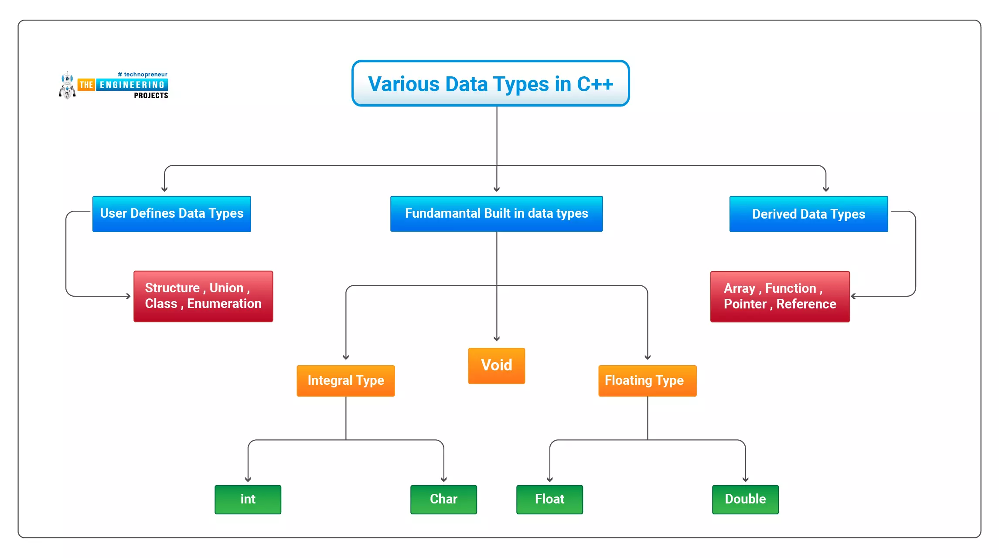
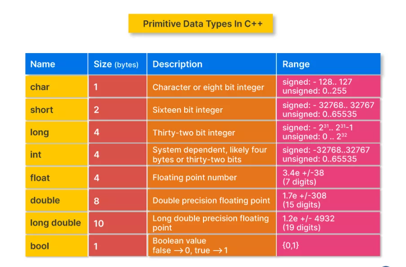
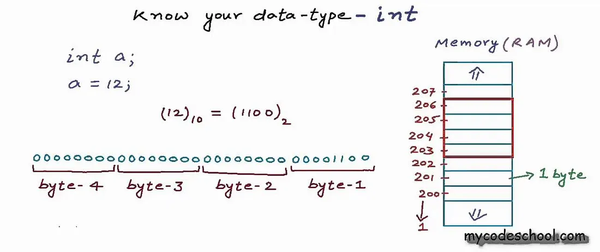
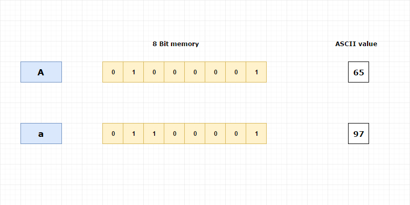

# Algorithm 
A series of step to solve a problem statement is called a Algoritm 

**How to approach a problem?**<br>
Thought process :<br>
step 1 :- Understand the problem
step 2 :- write the given input values
step 3 :- create a Logic/Algorithm 

HOW TO CONVERT YOUR THOUGHTS INTO SOLUTION 
P.S --> SOLUTION (INSIDE BRAIN) --> ROUGH SOLUTION (FLOWCHART OR PSEUDO CODE) --> HLL (C++) USER-FRIENDLY LANGUAGE --> COMPILER CONVERTS THIS HLL IN MACHINE LEVEL LANGUAGE

**Flow charts :- a digramatic representation of a algorithm**

Components
- oval block : start/ end also known as terminator
- parallelogram block : i/p or o/p block / read or print block
- rectangle block : process block -- - clacultaion/ intialization/ declaration
- diamond block : decision making block
- circular block : connector
- arrow : flow of execution

**Do it**
- question: check num is even or odd
- question: check +ve, -ve, =0
- question: print counting from 1 to N
- question: multiply N numbers from user
- question: print 1 to N, but only even numbers
   
---

`Looping`: <br>
steps:-
1. initialization (declaring looping variable )
2. condition
3. updation of looping variable 

# first cpp program 

## basic intial structure 
In c++ program, code starts from a `int main()` function. or you can says `main` is the entry point of our code.<br>
FUNCTION : FUNCTION IS A BLOCK OF CODE THAT TAKES SOME INPUT AND MAY RETURN SOME OUTPUT
```cpp
int main () {
    Scope of main function
}

// return-type function-name() {

// }

return 0;
```
here `int` is a `return-type` means this function will return an integer like `return 0`.

### cout (character output)
to print or display something we use cout (character output) 
lets code 
```cpp
int main() {
    cout<<"love balloo"
    }
```
>[!warning]
>when u execute it you will get an `error: use of undeclared identifier 'cout'` means compiler doesn't know about cout.

the definition of cout is placed under a header file i.e iostream (input output stream) 

To include a header file we write `#include<iostream>` on top of our program **`#inlcude` means preprocessor directive** <br>Working : before processing the entire code `#include` iostream (or any other file) file ko pehle se include krke rkh leta hai, like a manual which is needed to use a tool

```cpp
#include<iostream>

int main() {
    cout<<"love balloo"
    }
```
>[!warning]
>when u execute it you will get again an `error: use of undeclared identifier 'cout'; did u mean std::cout` means compiler doesn't know about cout.

compiler cannot identify the definiton of cout, compiler says i have multiple definition of cout in different different namespace 

Namespace is a portion of code and  multiple namespace can exist, and if your are getting the above error means there are multiple definitions of cout is present in different namespaces so we have to provide additional information for cout 

we will be using std namespace for `cout`.
either you use `std::cout` everywhere you use `cout` or just declare `using namespace std;` once at top of your program. we can also create our custom namespace 

```cpp
#include<iostream>
using namespace std';

int main() {
    cout<<"love balloo";
    }
```

### to print on a new line 
To print on a new line we use `endl` or a new line character `'\n'` in single inverted comma backslash n

```cpp
#include<iostream>
using namespace std;

int main() {
    cout <<'hello world' <<endl;
    cout<<endl;
    cout<<'\n';
    cout<<'hello \n world';

    return 0;
}
```
---
### return 0

**HINDI ANUVAAD :- return 0 se hmne ek trike ka singal bheja hai os ko ki execution successfully complete ho gaya hai**

In C++,` return 0;` is typically used within the `main()` function to indicate that the program **has executed successfully** and **terminated without errors**. This value is known as the `exit code` or `return code`.

**Here's a breakdown of its significance:**
- **Successful Execution:**
By convention, an `exit code` of `0` signifies successful program completion to the operating system or calling environment (e.g., a shell script).

- **Operating System Interpretation:**
The operating system can interpret this `0` to determine if the program ran as expected. This allows for conditional execution of other commands or actions based on the program's outcome.

- **Alternative for Errors:**
If a program encounters an error or fails to complete its intended task, a `non-zero value` (e.g., return 1;, return -1;) is typically returned to signal an error condition. Different non-zero values can represent specific error types.

- **Implicit Return:**
In C++, if the `main()` function is declared with an int return type and **no explicit return statement is provided at the end**, the compiler **implicitly adds return 0**; to **indicate successful completion**. However, explicitly including return 0; is considered good practice for clarity and portability.

# Datatypes and variables
- Variables in cpp is assigning a  name to a memory location 

- Datatype means type of a data.
In cpp to store different type of data it has different datatypes like 

    - for storing integer values we have int
    - for storing character values we have char
    - for storing decimal values we have float or double



>[!tip]
>Datatypes tells you two things:
>1. type of data
>2. size of data

`int marks = 90 ;`
lets break it down,
 
`int` --> datatype
`marks` --> variable-name
`=` --> assignment
`90` --> value 
`;` --> terminator

- **Built-In / Primitive datatypes**
int, char, float, double, bool, void


>[!Note]
> size of datatype is a `system dependent entity` like long it takes` 4 byte` size in `32-bit architecture system` and `8 byte` `in 64-bit architecture` 

- `bool` --> it returns true/false or 0/1
    - It takes only 1 byte of memory
    >[!Note]
    > Bool uses only 1 bit of memory then why extra 7 bits? why it takes 1 byte memory then ?
    > Becausethe minimum addressable memory allocation of memory is of 1 byte

    ```cpp
    int main(){
        bool flag = true;
        OR
        bool flag = 1;
    }
    ```

- `void` --> it returns nothing 
    ```cpp
    void main(){
        it doesnot returns anything
    }
    ```
- **derived data-types**
these datatypes are built using primitive datatypes arrays, pointers, references

- **User-defined data-types**
these are created by user structures, enumerations, unions, classes

## MEMORY VIEW OF `int a = 5;` or how to store +ve or  -ve
>[!important]
>- 1 byte = 8 bit
>- 1 bit = 0/1

**Storing +ve number**
`int a = 5;`</br>
what happens is </br>
Memory ke andar `int` ke liye ek `4 byte` ka block bn jaega jiska address suppose 108 (random according to memory) jiska naam `a` aur us block ke and `5` value rkhi hogi in binary. </br>
since int is takes 4 byte memory means 32 bits and binary of 5 is 101 so we fill the remaining bits with 0 so 5 in 32 bit binary will look like 00000000 00000000 00000000 00000101 also If the system allocate the address as 108 for variable a. Then the values are stored as follows.

- 108 - 00000101
- 109 - 00000000
- 110 - 00000000
- 111 - 00000000


[for detailed explanation visit](https://hugoalbertotrujillomartinez.medium.com/how-is-an-integer-value-stored-in-the-memory-in-c-b5e304872c16)


**Storing -ve number**
`int a = -5;`
negative numbers are stored using three steps 
1. **Ignore -ve sign**---> a = 5
2. **Convert to binary**  ---> 0000000 00000000 00000000 00000101
3. **Take 2's complement** ---> </br>
    *steps for taking 2's complemet*
    - Take 1's complement -- **flipping the bits 0 --> 1 and 1 --> 0** like:</br>
    0000000 00000000 00000000 00000101  --> binary of 5 </br>
    1111111 11111111 11111111 11111010  --> 1's complement

    - ADD 1 in 1's complement</br>
    1111111 11111111 11111111 11111011  --> 2's complement 

this  1111111 11111111 11111111 11111011 is the `-5` which will be stored in the memory 

>[!tip]
> 1+1 = 2, and 2 in binary is 10, so while adding 1+1 = 0 with carry 1

>[!tip]
>- suppose you have binary given 11111101 convert it to decimal ==> 
>- identify the sign which -ve here
>- then take 2's complement which will be 00000101 ==> decimal = 5 
>- since sign is -ve so -5


**Storing of character** <br>
- char alpha = 'A'

- it takes 1 byte i.e 32 bit memory space, and stores 'A' in binary form using its ASCII value </br>
like ASCII value of 'A' is 65 --> then converted to decimal


### Range or total combinations of char, int, double etc 

- for range you can check primitive datatypes image.

- Total combinations</br>
char --> 1 byte --> 8bit, Also in one block 2 numbers are possible either 0 or 1 <br
so total combination is 2^8 <br>
genric form : 0 - 255

- For `n` bits --> 2^n <br>
generic form : 0 - (2^n - 1)

**Do it**<br>
- Find the range and generic form for int, double, long, signedint,  unsigned int etc

### How to check size using code
we can find or check size of a variable using `sizeof()`

```cpp
#include<iostream>
using namespace std;

int main() {
   int num = 32;
   cout<<"size of num is : "<< sizeof(num);
    return 0;
}
```

output
```cpp
4
```

### garbage value
when we declare a variable and we try to print it **without assigning** any value it will **throw a random garbage value**. and this value will change in every run or execution

```cpp
#include<iostream>
using namespace std;

int main() {
   int num ;
   cout<< num <<endl;
    return 0;
}
```

output
```cpp
63456249  // garbage value
```

## variable naming conventions

**Mandatory Rules:**
- **Allowed Characters:**
Variable names can only contain letters (A-Z, a-z), digits (0-9), and underscores (_). 
- **Starting Character:**
A variable name must begin with a letter or an underscore. It cannot start with a digit. 
- **Case Sensitivity:**
C++ is case-sensitive, meaning myVar and myvar are treated as distinct variables.
- **No Keywords:**
C++ reserved keywords (e.g., int, float, class, public) cannot be used as variable names.
- **No Whitespace or Special Characters:**
Variable names cannot contain spaces or other special characters like !, #, &, etc.

**Common Stylistic Conventions:**

- **Descriptive Names**:
Choose names that clearly convey the variable's purpose or content (e.g., customerCount instead of cc).
- **CamelCase for Local Variables and Functions**:
Often, local variables and function names start with a lowercase letter and subsequent words are capitalized (e.g., myLocalVariable, calculateTotal).
- **PascalCase for Classes and Types**:
Class names and custom type names typically start with an uppercase letter, with subsequent words also capitalized (e.g., MyClass, InputIterator).
- **ALL_CAPS for Constants**:
Constants are frequently named using all uppercase letters with underscores to separate words (e.g., MAX_SIZE, PI).
- **Member Variable Prefixes**:
In some conventions, member variables of a class are prefixed (e.g., m_ for member, like m_data), though this is less universally adopted.
- **Consistency**:
The most crucial aspect of naming conventions is consistency throughout a project or codebase. Adhering to a chosen style guide ensures uniformity and improves collaborative development.

## Signed and Unsigned

- **Unsigned value** : It does not takes -ve numbers. range of a unsigned value always starts from 0 .<br>
Ranges that we have studied above, all are unsigned ranges like<br>
    * int --> 0 - 2^32 -1
    * char --> 0 - 2^8 -1 --> 0 - 257

- **Signed value**: it takes all types of numbers +ve, -ve, 0. signed Ranges are also different from unsigned one lets see taking 1 byte example i.e 8 bits<br>
    - the first bit is used to determine the sign aka `sign bit`. if first bit is `0` means it is a `+ve number` and if it is `1` then means it is a `-ve number `
    - Now for range ignoring the first bit wr remained with 7 bits, <br>
    now for +ve range --> 0 - (2^7 -1) --> 0 - 127 <br>
    for -ve range --> (-2^7) - (-1) --> -128 - (-1)<br>
    so final range for this 1 byte will be <br>
    ==> [-128, 127] so the generic form for n bits will be ==> **[-2^n, 2^n - 1]**
>[!note]
> `n` is the number of bits remaining after ignoring the first bit i.e `sign bit`

**task: determine the signed range for int datatype** 

**What if `unsigned char var = -ve number`**<br>
what if signed value is assigned to a unsigned variable like
```cpp
unsigned char c = -5
```

output
```cpp
// according to theory unsigned accepts only +ve integers it should give error

// output u will get is 
251

```
**Explanation:**<br>
- unsigned char can only hold values from 0 to 255
- -5 is outside this range, but C++ does not give a compile-time error
- Instead, it performs modulo 256 conversion (wrap-around)

**WHY ?**
>[!important]
>In C++, assigning a negative value to an unsigned type triggers modulo conversion:
>`unsigned_result = (signed_value) modulo 2ⁿ`

```cpp
c = -5 mod 256 = -5%256= 251    // for simple calculation 256-5 = 251
```

you will see two mechanisms on the internet 
1. using two's complement   ==> as when u do 2's complement on `-5` it gives u `11111011` and this represents `251` only in decimal but this is a manual way computer does not use this mechanism when signed value is assigned to unsigned variable it automatically undergoes moduolo conversion 
   - although there is a shortcut formula for interpereting 2's complement `(UNIT_MAX + (signed value with sign) + 1)`
   - where unit_max is the maximum value of the unsigned range i.e `(2^n -1)` for this case it is `255`

2. using modulo conversion 
`unsigned_result = (signed_value) modulo 2ⁿ` n = 8 bits for char

c = -5 % 256 = 251

## 🧠 Signed vs Unsigned Integer Conversion in C++

Understanding how negative values are handled in C++ is crucial when working with signed and unsigned types.


| Concept             | Applies To        | Description                                        | Add +1?        |
|---------------------|-------------------|----------------------------------------------------|----------------|
| **Two’s complement** | Signed types       | Create negative values: invert all bits, then +1   | ✅ Yes (manual) |
| **Unsigned wraparound** | Assigning to unsigned | C++ converts via modulo 2ⁿ (bit-width of the type) | ❌ No (auto)    |

### 📝 Summary

- **Two’s complement** is used to store negative numbers in binary.  
  Example: `-5` in 8-bit → `11111011`  
  (Binary of +5 → Invert → Add 1)

- **Unsigned wraparound** happens when assigning a negative value to an unsigned variable.  
  Example:  
  ```cpp
  unsigned char c = -5;  // c becomes 251 due to modulo 256

[!note]
>- These two concepts lead to the same bit patterns, but are used in different contexts.
>- 💡 Think of two's complement as how negatives are stored, and unsigned modulo as how negatives are interpreted when assigned to unsigned types.

### WHAT TO TAKE BY DEFAULT SIGNED OR UNSIGNED 

Great question! In C and C++, if you **don’t specify** `signed` or `unsigned`, the compiler assumes **defaults** based on the data type.

---

## ✅ Default Signedness Rules in C/C++

| Type    | Default Signedness         | Notes                                |
| ------- | -------------------------- | ------------------------------------ |
| `int`   | `signed int`               | Always signed by default             |
| `char`  | **Implementation-defined** | Can be either `signed` or `unsigned` |
| `short` | `signed short`             | Default is signed                    |
| `long`  | `signed long`              | Default is signed                    |

---

### 🔹 Examples:

```cpp
int a = -10;         // same as signed int a = -10;
short b = -5;        // same as signed short
long c = 1000;       // same as signed long

char ch = -1;        // ⚠️ Depends on compiler: signed OR unsigned
```

---

## ⚠️ Special Case: `char`

Unlike `int`, the plain `char` type is tricky:

* On **GCC**: usually `signed char`
* On **ARM/embedded**, may default to `unsigned char`
* On **MSVC (Windows)**: usually `signed char`

### ✅ To be safe:

```cpp
signed char ch = -1;     // guaranteed signed
unsigned char ch = 255;  // guaranteed unsigned
```

---

## 📌 TL;DR

| Type    | If not specified                               |
| ------- | ---------------------------------------------- |
| `int`   | `signed int`                                   |
| `short` | `signed short`                                 |
| `long`  | `signed long`                                  |
| `char`  | ❓ Implementation-defined (check compiler docs) |

---

Let me know if you want to check what your system uses for plain `char` — I can give you code to detect it!


# operators
1. Arithmetic operators (+, -, *, /, %) 
understand typecasting

2. Relational operators (>, <, >=, <=, !=, ==)

3. Assignment operator ( = )

4. Logical operator (&&, ||, ==)
`&&` ==> if all true ==> o/p true
`||` ==> koi bhi ek true ==> o/p true
`==` ==> 	Equality Check ==> Compares two values for equality

5. Bitwise operator

 **suppose we are doing 2+3 where 2, 3 are know as operand and + is a operator**<br>
**Bitwise is a bit level opertion**

- Bitwise AND --> `&` **both true then gives true** means 1 & 1 = 1, and rest other case gives 0
- Bitwise OR --> `|` **anyone is  true then gives true** means 1 | 0 = 1, 0 | 1 = 1, 1|1 = 1  and rest other case gives 0|0 = 0
- Bitwise NOT --> `~`  **flips the bits 1 to 0 and vice versa** it makes +ve number to -ve number and vice versa
- Bitwise XOR --> `^`  **if both bits are same then it gives 0** for diff bits gives 1. i.e xor of same numbers 5^5 = 0
- Left shift operator --> `<<` **multiplies by 2pow(n)**
- Right shift operator --> `>>`**divides by 2pow(n)**

>[!NOTE]
>- Signed integer ke case mein, agar hm right shift krte hai kisi -ve number ko toh sahi output de rha hai toh compiler handle kr rha hai 
>- but BTS dekhe toh -ve ko right shift kiya toh woh ek large +ve number bn jaa rha hai. but our compiler handles the case and gives u the ans by dividing 2 
>- ```cpp
    int n = -100 ;
    cout<<(n >> 1);     // prints -50 since compiler handled it, also because it is a by default signed integer i.e compiler handled it 

    unsigned int n = -100;
    cout<<(n >> 1);  // prints 214783598 i.e large +ve number, now compiler first converted it in a unsigned integer i.e  +ve number and then right shift by 1 
    ```

>[!warning]
>- incase of -ve shifts like (n>>-1) or (n<<-1) it is not valid but compiler does not gives a errror
>- compiler gives a warning and throws garbage value


## 🧾 Character and String Literals in C++

C++ is quote-sensitive — single quotes (`' '`) and double quotes (`" "`) have very different meanings.

1. **' ' (Single Quotes) — Character Literals**
- A single quote like 'a' means a character literal.

- Character literals in C++ are interpreted as integers, based on their ASCII value (or Unicode in modern compilers).

- `'size of a is :'` is invalid, because you're placing multiple characters inside single quotes. C++ interprets `'size of a is :'` as a multi-character literal, which is technically allowed but has undefined or implementation-defined behavior.

```cpp
int a;
cout << 'size of a is : ' << sizeof(a) << endl;
// This gives junk like: 19314918724 because 'size of a is :' is an illegal multi-char constant
// 👎 BAD: multi-character constant
```

 2. **" " (Double Quotes) — String Literals**
- A double quote like "a" is a string literal, i.e., a sequence of characters ending with \0.


This is the correct way to output text.

So:

```cpp
cout << "size of a is: ";  // ✅ GOOD: proper string
```

### 🔤 Literal Types

| Literal Type       | Quotes Used | Data Type     | Example     | Output Description           |
|--------------------|-------------|----------------|-------------|------------------------------|
| **Character**       | `' '`        | `char` / `int` | `'A'` → 65  | ASCII value (numeric)        |
| **String**          | `" "`        | `const char*`  | `"A"` → "A" | Proper null-terminated string |
| **Multi-char char** | `'abc'`      | `int`          | `'abc'`     | Undefined / implementation-defined garbage value |


>[!Note]
>- `'A'` is a single character, its value is the ASCII code: `65`
>- `"A"` is a string literal — actually an array of 2 chars: `'A'` and `'\0'`
>- `'abc'` is a **multi-character constant**. It's allowed in C++, but its value is **implementation-defined** and almost never useful. Avoid it!

>[!tip]
> 💡 Always use `" "` for text, and `' '` for single characters.

multi-char literals like it is difficult when map to ascii VALUE AND ITS RESULTS DIFFER ACROSS COMPILERES AND ARCHITECTURES. NO USE CASE IN MODERN C++  

USE INSTEAD
- Use a string literal: `"AB" → const char*`
- Or an array of chars: `char arr[] = {'A', 'B', '\0'};`
