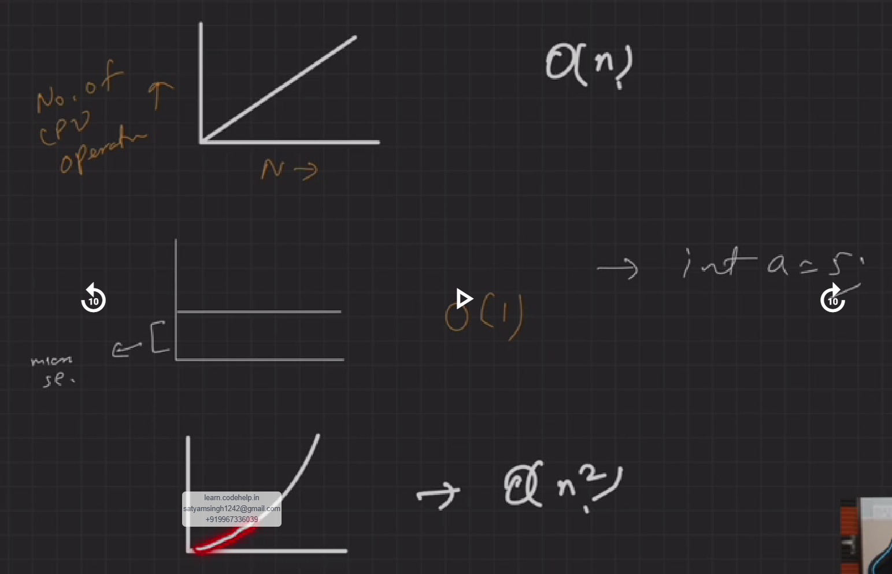
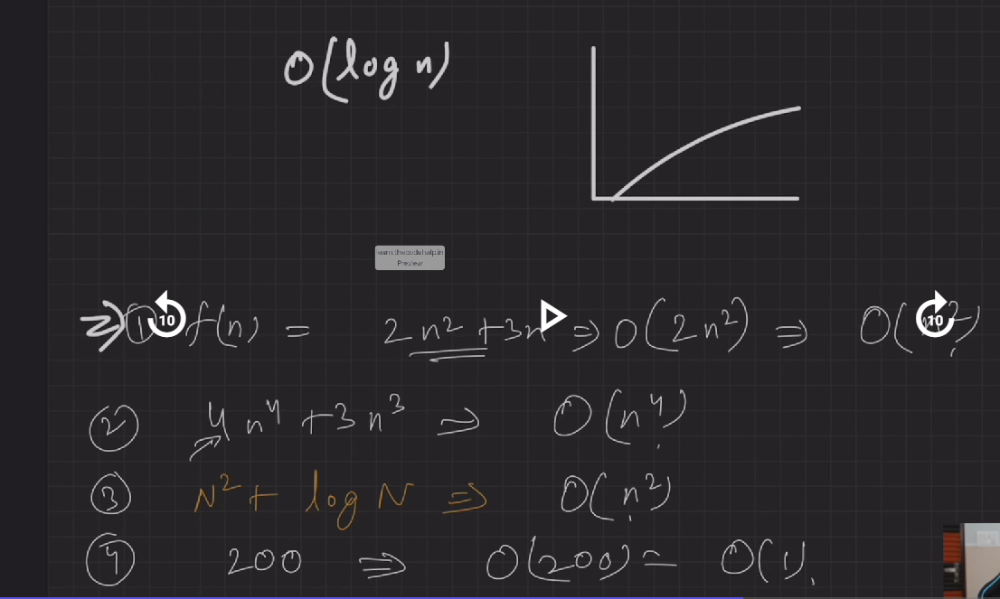
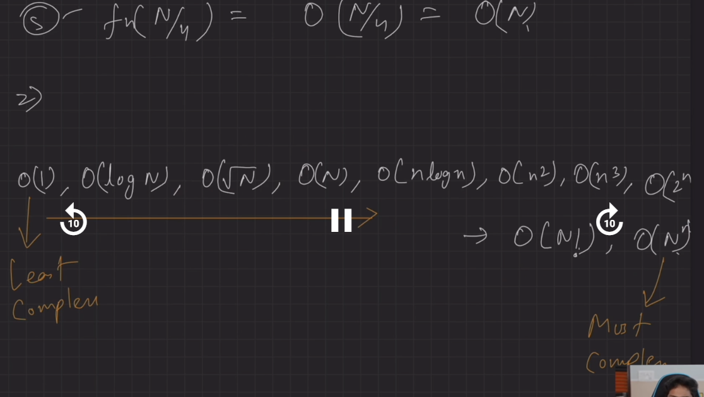
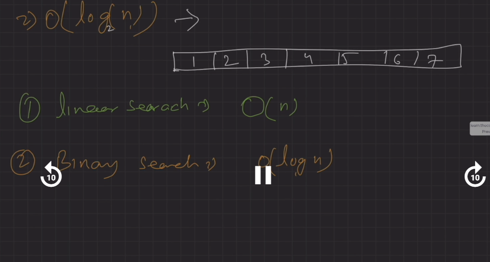
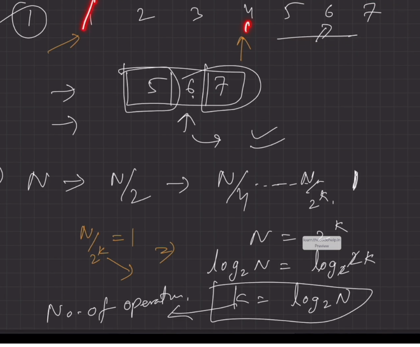
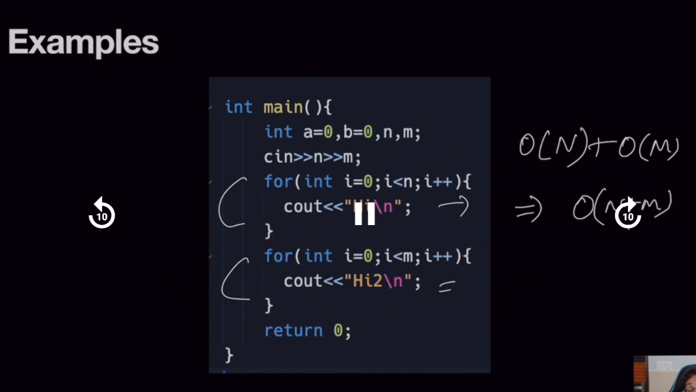
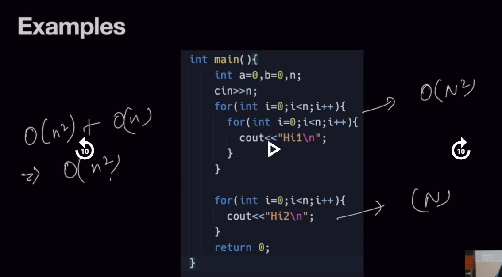
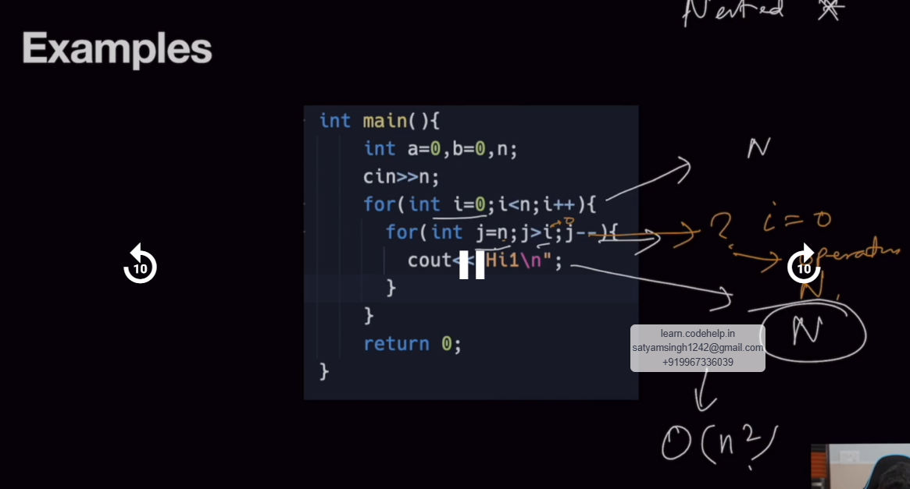
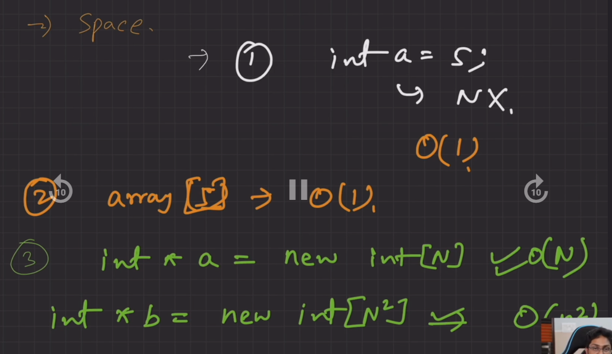

# What is Time Complexity?
1. Amount of time taken by an algorithm to run as a **function of length of input**.
- Means for example when you run a for loop for(int i = 0; i< N ; i++) so who is running this for loop ==> our CPU is running the for loop again and again till N i.e N times.
- i.e we can say that time taken by this function is `directly proportional to N`i.e we increase number of operations, time taken by cpu increases
- Where as `Amount of time` is refered as `number of CPU operations`.

>[!note]
>remember Amount of time does not refered as the actual time.

so we can say the `time complexity` of the for loop is **BIG O OF N i.e O(N)**

## Why to study T & S complexity
- Good computer engineer always thinks about the complexity of the code written by him 
- Resources are limited
- measure algorithm to make efficient programs
- asked by interviewer after every solution you give

# what is Space complexity ?
1. Amout of space taken by an algoritm to run as a **function of length of input.**

it is again dependent on N only, like increasing N increases the space 
lets discuss two scenarios 

- when not dependent to n ----> constant `O(1)`
 ```cpp
int a = 1; // variable -- takes 4 bytes in the memory 
int b[5];   // array -- takes 4*5 = 20 bytes in the memory 
// what will be the space complexity here ?
```

since both the variables are not dependent on n, it is refered as constant time or constant space `O(1)`

- when dependent on n 
```cpp
int n ;
cin>>n;

int *b = new int [n]; // now this variable is dependent on n 

// print array b
for (int i=0; i<n; i++){
    cout<< b[i];       
}

// now if n=2 then b[2]
// n=200 then b[200]
// n=2000 then b[2000]

// what will be the space complexity here?
```

since it is dependent on n, the `space complexity` here will be `O(N)` .


# Unit to Represent Complexity
1. Big O : Algo's upper bound --> worst se worst case ky hoga --> maximum se maximum kitna time lgega
2. Theta : Average Case
3. Omega: Lower Bound --> kam se kam kitna time lega

# Big O: Complexities 
>[!Note]
>we always study Big O only, because it gives us the maximum time taken scenario or u can say worst to worst case mein kitna time lega
1. constant time : `O(1)`
2. Linear time : `O(n)`
3. Logarithmic time : `O(log n)`
4. Quadratic time : `O(N^2)`
5. Cubic time : `O(N^3)`

## Graphs of the complexity b/w no.of operations and N 
- *Graphs b/w no. of operations and `N`*



- *Order of the complexity*


## Time complexity of linear search and binary search 


 *Derivation of binary search* 


## Examples 
1. if the loops are not nested we add the complexities for the final TC


2. when adding the complexities we always take the upper bound only for the final complexity as shown in the example: the upper bound in n^2 and n is n^2


3. In case of nested loops find the upperbound complexity of the inner loop and also the upperbound of the outer loop, since both the loops are nested final comlexities is determined by multiplying both the upper bound complexity. since both are N so TC will be n^2.


# Examples of the Space complexity
