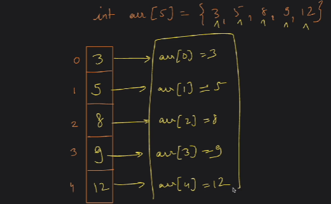

# Array 
- it is the first data structure we are studying
**what is an array ?**
- it is a list of similar items
- it is a collection of elements
- it is a datastructure -- way of storing data
- continuous memory block
 

**Why array is needed?**
- Suppose when you have to store 2 numbers inside memory, then we have to create 2 memory locations by writing 2 variables.
- what if we need to store 10 numbers or more like 100 nos or 1000 numbers or even more which requires 10 or 100 or 1000 lines for just creating variables 
- By using array we can create any number of locations inside memory by just writing one line of code 


*Creation of Static-array*
```cpp
char alpha[26];  // 26 x1 = 26bytes

bool flags[27];  // 27 x 1bytes = 27bytes

int arr[10];  // 10 x 4bytes = 40 bytes

// static array representation ----> why static? > bcz we have fixed the size of our array 
 
// int represents: kis type ka data blocks mein store hoga
// arr : array ka naam, array ke first block ka naam hm arr se represent krenge 
// [10] : this says ki 10 continuous blocks create krdo 

// the whole code says 10 continuous blocks bna do jiske first block or base address or starting address ka naam arr hai aur saare blocks mein integer type ki values hi hongi 

// size of the array, since int takes 4 bytes so total size of array will be 10 x 4 = 40 bytes of memory as we have fixed it i.e it is known as static array 

// we can find the address of any block by using address of operator i.e `&var-name` and a `sizeof()` a built in function for size of array 
```


**Array kis address se start ho rha hai**
is literally when we write int a = 5 means that a block will be created in a memory whose name is a and its value is 5 ===> NO, IT IS JUST FOR OUR UNDERSTANDING

*Reality*
when you write `int a = 5;` then a block in the memory is created who has value `5`, the block will have a address in the memory, lets say 104. Then the compiler will track a table, lets say symbol table, where a `mapping will be tracked for variable by its address`.
- it means whenever user will say or call `a` then smajh jaana ki wo 104 address ki baat kr rha hai 

- in case of array variable-name i.e arr will be mapped to the `Base address`


## Address of operator (&)
```cpp
int a = 10;
cout <<" address of a is :" << &a <<endl;

// for array
int arr[10];
cout <<" Base address of arr is :" << &arr <<endl; // 0xacfefff8e0
cout <<" Base address of arr is :" << arr <<endl; // 0x13585ffc50
// both gives the base address, means using address of operator is optional in case of base address of static array 

// might be a question what happens when we give some values

int arr[3] = {1, 2, 3}; 
cout <<" address of arr[0] is :" << arr[0] <<endl; // output: 1 it is accessing the elements of array
cout <<" address of arr[0] is :" << &arr[0] <<endl; // output: 0xacfefff8e0    --> now it gives the address

// now printing arr ----> will give base address as prev
// but now if arr[0] ---> this will give 1, as now it will be accessing elements of array. if you want to print or access the address of arr[0] then you have to use the address of operator i.e & &arr[0]

```
>[!Note]
> In case of array, when you `cout<< arr` it also gives the base address of arr like `cout<< &arr`

## sizeof() built-in function

```cpp
int a = 10;
cout <<" size of a is :" << sizeof(a) <<endl; // output : 4 bytes

// for array
int arr[10];
cout <<" size of arr is :" << sizeof(arr) <<endl; // output: 40 bytes

```

## Array initialization
There can be 4 possible scenarios of initialization

1. size is not mentioned
- when number of blocks is not mentioned, it is created according to the values inside the array like `int arr[] = {1,3,5,7,6,8,3}` means jitni mrji chahe values add krdo 

2. Exact same number of elements as of size
- `int arr[5] = {1,2,3,4,5}`

3. when size of array is greater than the elements inside the array
- >[!Important]
- >`int arr[5] = {2,3}` then in this case the remaining spaces will be filled with `0` 
means ==> `int arr[5] = {2,3,0,0,0}`

4. when size of array is less than the elements inside the array
- >[!warning]
- >`int arr[2] = {1,2,3,4,5}` then in this case we will see `ERROR: access element in array initializer`


>[!Note]
> Notice size is represented by square braces `[]` and it is initialized by curly braces`{}` 

*What happens when the size of array is given by the user*

```cpp
int n;
cin>> n;  // user input

int arr[n];  // In many compilers it can work seamlessly but in some it can give error why ??
// every system has limited memory to run a program what if user gives some big number and system cannot create that amount of continous memory ... that is why it is considered as a bad practice

// to prevetn this case we were creating DYNAMIC ARRAYS will be studied later
```

> [!warning]
> It is very very Bad practice and only be prevented by using DYNAMIC ARRAYS

## Indexing in Array
- Indexing in array always starts from zero `0`i.e ZERO BASED INDEXING
- To access any particular address or block of an array can be accessed via indexing

- >[!Tip] 
>If you have n-size of array then index of `first` block is `0` and Index of `last` block is `n-1`



*Accessing the elements of an array*
```cpp
int crr[5] = {5, 8, 9, 12, 13};
    
    int n = sizeof(crr) / 4;
    for (int i = 0; i < n; i++) {
        cout << "Element at index " << i << ": " << crr[i] << endl;
    }
```

**Taking input in a array**
```cpp
int arr[5];     // Initialized but no value --> then initially it has garbage values in all the blocks when this line is executed
int n = 5 ;
for(int i = 0 ; i<n; i++){
    cin>> arr[i];
}
```

*BEHIND THE SCENE HOW ACCESSING OR STORING VALUE INSIDE AN ARRAY*
- Basically what is `arr[i]`

formula:
`arr[i]` ====> Value at `(Base Address + (Data-type-size * index))` the output of the formula is address

B.T.S the compiler is calculating with this formula and then accessing the addresses 


```cpp
// always TODO:
 // problem statement 1
    // 1. 10 size array banao
    // 2. 10 elements input lo
    // 3. double-up each value of the array

//  problem statement 2
    // 1. 5 size array banao
    // 2. 5 elements input lo
    // 3. Print Total sum of the array

// problem statement 3:  LINEAR SEARCH 
    // 1. i/p: [2,4,6,8,10,12] , int target = 10
    // 2. o/p 10 found or not found
    
```

### FLAG VARIABLE CONCEPT
>[!tip]
> In linear search when you stuck, when you have to print else case outside the loop, how will you do it. Use a flag variable 
 

>[!warning]
>Never use size of array using aizeof() because it gives the size of whole array, so in case of when `size < elements of an array` as there will 0 in the remaining blocks 

## Arrays and Functions

- > [!Note]
> whenever passing an Array inside a Function then You also have to pass size of the array 
because there is no other way to find the size of the array. if thinking about the sizeof() built in function read the above warning

```cpp
void printArray (int arr[], int size){
// function that prints the elements of an array
}

int main( ){
    int arr[5] = {2,3};
    int size = 5;    // sizeof(arr) / 4 won't be valid because sizeof() will give the size of whole array
 
    printArray(arr, size);  // calling the function

    return 0
}
```

>[!tip]
> do every question with 4-5 test cases for good confidence

Todo: write function for linear Search 
Todo: Count 0's and 1's in an Array
Todo: Minimum no in an array

>[!Tip]
> *BEST PRACTICE*
> INT_MAX INT_MIN these are the predefined variables given by <limits.h> header file, to use these variables you have to include it first
> int minAns maxAns
> - To find minimum no ---> initialize minAns with INT_MAX
> - To find maximum no ---> initialize maxAns with INT_MIN


Todo: Reverse an Array for even array also odd array:- 
>[!Tip]
> use a predefine function swap(a,b) with 2 intialization and 2 updation

Todo: Extreme print in an Array like

